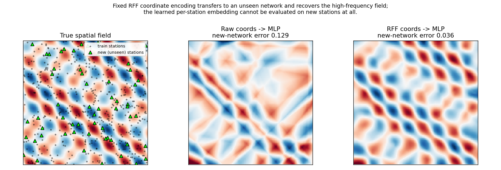

# Transferable coordinate encoding with Random Fourier Features

A small, self-contained demonstration of one idea: encoding a spatial node
(a sensor, a station, a point in a network) by a **fixed, parameter-free
Random Fourier Feature (RFF) map of its coordinates**, instead of a
**learned per-node embedding table**.

The difference decides whether a trained model can be reused on a network it
has never seen.



## The idea

Many spatial models give every node its own *learned* embedding vector,
indexed by the node's identity. That welds the trained model to one exact
network: a node that did not exist at training time has no embedding, so the
model has nothing to say about it.

An RFF coordinate map removes that limitation. It encodes a node by *where it
is*, not *which node it is*:

```
phi(x) = cos(2*pi * (W @ x) + b),      W, b drawn once and then frozen
```

Because `phi` is a fixed function of the coordinates, identical coordinates
always map to identical features — in any network. The same trained weights
then run unchanged on a network of different size and geometry. Drawing `W`
from a Gaussian also lifts the low-dimensional coordinates into a form a
small MLP can actually fit at high frequency, which raw coordinates alone
cannot (the "spectral bias" problem).

## What the demo shows

A synthetic high-frequency field is sampled at random station positions
(with noise). A model is trained on one **training network** and then, with
no changes and no retraining, evaluated on a **separate network of new
station positions**. Three encoders share the same prediction head, so the
only thing that varies is how a station is encoded:

| Encoder | Fit on training network | Transfer to a new network |
|---|---|---|
| Learned per-station embedding | 0.003 | **cannot transfer** (no rows for unseen stations) |
| Raw coordinates → MLP | 0.083 | 0.129 |
| **RFF coordinates → MLP** | **0.003** | **0.036** |

(Error is mean-squared error against the clean field; lower is better.
Numbers are printed by the script and are reproducible from the fixed seed.)

Two things to read off the table:

1. The **learned embedding** fits its own network but structurally *cannot*
   be evaluated on new stations — the exact limitation the coordinate map
   removes.
2. Among the encodings that *can* transfer, the **raw-coordinate MLP
   underfits even the training field** (spectral bias), while the **RFF map
   fits it and transfers** to the new network roughly 3–4× better.

## Run it

```bash
pip install -r requirements.txt
python rff_encoding_demo.py
```

It runs on CPU in a few seconds and regenerates `figure.png` and the results
table.

## Scope and honesty

This is a **mechanism demo on fully synthetic data** — it isolates *why* a
fixed coordinate encoding transfers where a learned table cannot. It is not a
benchmark and makes no scientific claim. The idea comes from my master's
research on transferable deep-learning models for spatial sensor networks;
this repository reimplements only the coordinate-encoding mechanism, from
scratch, on toy data.

Transferring cleanly (running unchanged on a new network) is a *different and
weaker* property than fully generalising (achieving the same accuracy on a
new domain). This demo illustrates the first, not the second.

## References

- A. Rahimi and B. Recht, *Random Features for Large-Scale Kernel Machines*,
  NeurIPS 2007.
- M. Tancik et al., *Fourier Features Let Networks Learn High Frequency
  Functions in Low Dimensional Domains*, NeurIPS 2020.

## License

MIT — see [LICENSE](LICENSE).
